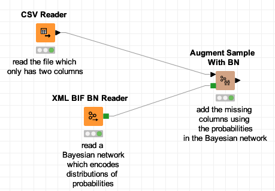

# knime.bayesiannetworks

Bayesian Networks nodes for KNIME.
Enables the generation of synthetic datasets, generation of synthetic populations, learning of statistical models, statistical inference. 

## Features

Adds nodes for the KNIME workflow engine to use Bayesian networks.

* read Bayesian networks (from the XMLBIF format)
* write Bayesian networks (in XMLBIF, BIF and net formats)
* sample data from a Bayesian network: create n entities compliant with the distribution of probabilities described by the network
* complete existing data tables by addings new columns and the probability from the network
* add nodes to a Bayesian network from KNIME data tables
* enumerate all the combinations of values and the corresponding probabilities
* compute the probability of a row
* measure the difference between two Bayesian networks having the same structure

# install it

The easiest way to install the plugin is to use the update site I publish in https://knime.res-ear.ch 

Using KNIME version 4.2 or above, go to menu Help/Install new software. 
Click the "Add..." button and add repository:
   Name: samthiriot KNIME nodes
   https://knime.res-ear.ch

Then select "Bayesian Networks for KNIME", and follow the usual process. 

# Use it

## Read, Sample, Measure

A basic case is to read an existing Bayesian network from a file and to sample entities (generate KNIME rows).
To measure the quality of the sampling, one learns the probabilities of the Bayesian network and compare them with the reference network.

You can [download it](./doc/example_read_sample_measure.knwf) to try it yourself.

## Create, Sample, Write

The Bayesian network can be easily created in KNIME. 

In this example ([download it](./doc/example_create_sample_write.knwf)), we show:
* how to read a table from a CSV file, and use it as the Conditional Probability Table of a new variable in the Bayesian network
* how to create a table by hand in KNIME, and use it as a Conditional Probability Table of a new variable,
* how to aggregate statistics from a KNIME table by using a standard "group by" node, then insert it as a Bayesian network 

Then the Bayesian network can be used for sampling or data augmentation, and can be written in standard format.

## Data fusion 

The Bayesian network can be used to "augment" or join data.

In this example ([download it](./doc/example_augment_data.knwf)), we show:
* we read existing data having only two columns `surface` and `annee` 
* the missing column is present in the Bayesian network which describes `p( combustible | surface, annee )`
* for every row, the node samples missing data according to the probabities `p( combustible | surface, annee )` and existing values `surface` and `annee` in the row. 

# developers' corner 

## set up development environment 

* set up a development environment for a KNIME plugin as . This involves to 
* clone this repository, then import it as Java projects into Eclipse
* download jar dependancies: run the "maven copy dependancies into lib.launch"

test the code without KNIME:
* directory "test", run as... JUnit. This should heat your CPU a bit but should end with green lights (timeouts are acceptable as they depend on the test cases and your configuration). Solve dependancy issues.

test the plugin inside KNIME:
* right click on knime-sdk-setup, run as... run configurations... KNIME Analytics
* the "Bayesian Networks" logo should be part of the splash screen
* the "Bayesian networks" section should be visible in the "community" family
* create a new KNIME workflow 

## frequent questions

Par of dependancies are managed by Maven. Yet they are packaged as libs in the plugin:
* maven dependancies are in pom.xml
* refresh the maven dependancies
* then run the "copy maven dependancies into lib"
* then ensure all these libs are both in the plugin.xml imports but also in the build path 

## export the plugin

See https://github.com/samthiriot/knime.updatesite