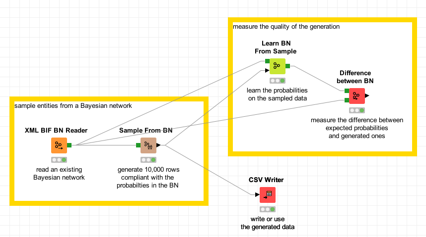
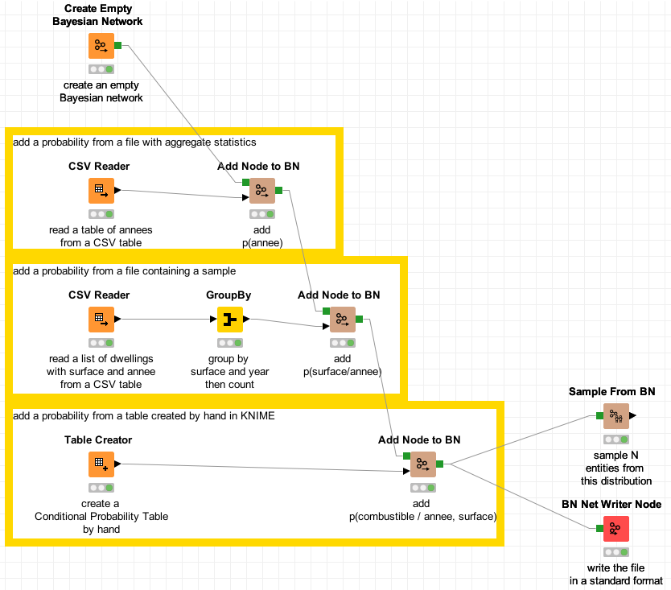

# knime.bayesiannetworks
Bayesian Networks nodes for KNIME

## Features

Adds nodes for the KNIME workflow engine to use Bayesian networks.

* read Bayesian networks (from the XMLBIF format)
* write Bayesian networks (in XMLBIF, BIF and net formats)
* sample data from a Bayesian network: create n entities compliant with the distribution of probabilities described by the network
* complete existing data tables by addings new columns and the probability from the network
* add nodes to a Bayesian network from KNIME data tables
* enumerate all the combinations of values and the corresponding probabilities
* compute the probability of a row
* measure the difference between two Bayesian networks having the same structure

# install it

The easiest way to install the plugin is to use the update site I publish in https://knime.res-ear.ch 

Using KNIME version 4.2 or above, go to menu Help/Install new software. 
Click the "Add..." button and add repository:
   Name: samthiriot KNIME nodes
   https://knime.res-ear.ch

Then select "Bayesian Networks for KNIME", and follow the usual process. 

# Use it

## Read, Sample, Measure

A basic case is to read an existing Bayesian network from a file and to sample entities (generate KNIME rows).
To measure the quality of the sampling, one learns the probabilities of the Bayesian network and compare them with the reference network.

You can [download it](./doc/example_read_sample_measure.knwf) to try it yourself.

## Create, Sample, Write

The Bayesian network can be easily created in KNIME. 

In this example ([download it](./doc/example_create_sample_write.knwf)), we show:
* how to read a table from a CSV file, and use it as the Conditional Probability Table of a new variable in the Bayesian network
* how to create a table by hand in KNIME, and use it as a Conditional Probability Table of a new variable,
* how to aggregate statistics from a KNIME table by using a standard "group by" node, then insert it as a Bayesian network 

Then the Bayesian network can be used for sampling or data augmentation, and can be written in standard format.

